# Santiago Bustos Pianda - Tuya SA — Prueba de Ingeniería de Datos


## Diagrama general

<picture>
	<source srcset="Documents/diagrama-final.png" type="image/png">
	
</picture>

## Resumen ejecutivo

| Ejercicio | Entrada | Salida | Logro |
|---|---|---|---|
| 1. Dataset de teléfonos | Diseño + contrato `ex1_ex2_telefonos_kpis/data_contract.yaml` | Modelo y reglas listas para publicar (gold) | Dataset único, trazable y con calidad (E.164, frescura, opt-in) |
| 2. KPIs y trazabilidad | Dataset teléfonos (silver) + `run_id` | Dashboard con KPIs y alertas; auditoría por corrida | Veeduría simple con gates que bloquean si no hay mínimos |
| 3. Rachas (SQL + SQLite) | `ex3_rachas/data/raw/rachas.xlsx` | `ex3_rachas/resultados.csv` y `ex3_rachas/db/rachas.db` | Rachas por cliente según niveles N0..N4, fecha_base y n |
| 4. HTML→Base64 (stdlib) | HTML(s) o carpeta (ej. `ex4_html2base64/examples/`) | `*.inlined.html` + resumen `{ success, fail }` | Inline de imágenes locales sin tocar el original, 100% stdlib |

## Estructura

```
.
├─ ex1_ex2_telefonos_kpis/     # Diseño conceptual: dataset teléfonos, KPIs, dashboard, contrato
├─ ex3_rachas/                 # Pipeline SQL + SQLite para rachas por niveles de saldo
├─ ex4_html2base64/            # Script(s) Python stdlib: inline de imágenes en HTML a Base64
├─ requirements.txt            # Dependencias (pandas/openpyxl/pytest) para ex3 y tests
└─ README.md                   # Este documento
```

## Setup rápido
- Python 3.11+ recomendado
- Instalar dependencias (para ex3 y tests):
```
pip install -r requirements.txt
```

---

## 1) Dataset de Teléfonos (conceptual)
Ruta: `ex1_ex2_telefonos_kpis/README.md` y `ex1_ex2_telefonos_kpis/data_contract.yaml`.

- Modelo simple: `telefonos` y `telefonos_hist` (trazabilidad de regla aplicada).
- Reglas: E.164, 1 activo por cliente+tipo, frescura, opt-in, +57 por defecto (local), exclusión de blacklists.
- Deduplicación determinística: opt_in DESC, updated_at DESC, fuente (crm>batch>otros), país ‘+57’ primero.
- Privacidad: evidencia de consentimiento (Habeas Data) y mínimo acceso a PII.
- Pipeline: Ingesta → Validación/Estandarización → Dedup → Publicación → Auditoría/Observabilidad.
- Medallion (ligero): bronze_ (crudo) → silver_ (limpio con KPIs/gates) → gold_ (publicado).

> Data contract: acuerdo mínimo de columnas y umbrales; si no se cumplen, el pipeline no publica (gate en CI/CD).

---

## 2) KPIs y Trazabilidad (conceptual)
Ruta: `ex1_ex2_telefonos_kpis/README.md` (sección “Ejercicio 2”).

- Vista negocio: calidad (E.164), duplicados, actualización (días), consentimiento, novedades y contactabilidad.
- Dashboard: portada con semáforos y tendencias, calidad por fuente/tipo con “ver muestras”, contactabilidad por segmento, novedades y exportar “teléfonos activos”.
- Alertas: mínimos (calidad < 95%, duplicados > 1%, actualización > 60 días) bloquean publicación y notifican.
- Auditoría: registro de reglas/resultados y lineage por corrida (run_id).

---

## 3) Rachas — SQL + SQLite
Ruta: `ex3_rachas/` (README con detalle y scripts).

- Flujo: XLSX → CSV → SQLite → SQL → resultados.csv

Entradas y salidas:
- Entrada principal: `ex3_rachas/data/raw/rachas.xlsx` (hojas: historia, retiros).
- Intermedios: `ex3_rachas/data/historia.csv`, `ex3_rachas/data/retiros.csv`, base `ex3_rachas/db/rachas.db`.
- Salida final: `ex3_rachas/resultados.csv` con columnas `identificacion, racha, fecha_fin, nivel`.

Reglas aplicadas:
- Clasificación N0..N4 por rangos de saldo.
- Cliente ausente en un mes: N0, excepto si el corte es posterior a su retiro.
- Rachas: meses consecutivos en el mismo nivel; filtra rachas ≥ n; si hay varias, toma la más larga y, a igualdad, la más reciente (≤ fecha_base).

Ejemplo de salida (CSV):
```csv
identificacion,racha,fecha_fin,nivel
DWJ0GFUKS12L7Y0G9,6,2023-11-30,N2
IGOQX9XYBSRDMOZXT,6,2023-12-31,N4
```

---

## 4) HTML → Base64 (stdlib)
Ruta: `ex4_html2base64/` (README con ejemplo y CLI).

Entradas y salidas:
- Entrada: uno o más HTML o directorios (p. ej., `ex4_html2base64/examples/index.html`).
- Salidas: archivo `.inlined.html` junto al original y resumen por ejecución `{ success: {}, fail: {} }`.

Alcance y limitaciones:
- Solo convierte imágenes locales referenciadas en `` a data URI Base64; no toca `http/https` ni `data:` ya inline.
- No modifica el original; crea un nuevo archivo con sufijo `.inlined.html`.

Ejemplo de salida (JSON):
```json
{
	"success": {
		"C:\\...\\ex4_html2base64\\examples\\index.html": [
			"C:\\...\\ex4_html2base64\\examples\\images\\tuya.svg"
		]
	},
	"fail": {}
}
```

---

## Calidad CI/CD y notas adicionales
- Data Contract (`ex1_ex2_telefonos_kpis/data_contract.yaml`): columnas y reglas básicas; umbrales mínimos (E.164 ≥ 95%, duplicados ≤ 1%).
- Gates: si fallan mínimos, no se promueve de silver_ a gold_ y se notifica.
- Auditoría/lineage: registro por corrida (`run_id`) de reglas, KPIs y transformaciones.
- Tests: existen pruebas para ex3 (rachas) y ex4 (html2base64) que se ejecutan con Pytest y Github Actions directamente al hacer algun commit.
- ex4 usa solo librería estándar; ex3 usa pandas/openpyxl para preparación y pytest para pruebas.
